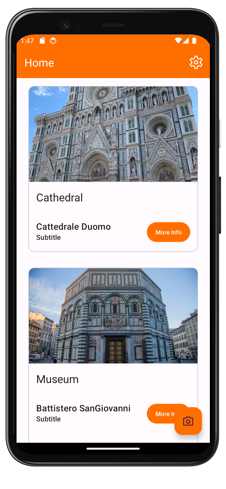
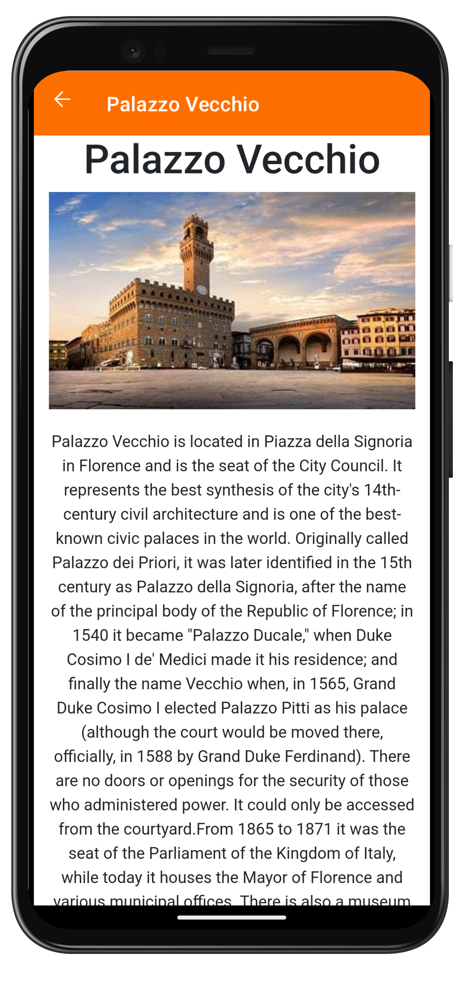

<a name="readme-top"></a>

<!-- PROJECT LOGO -->
<br />
<div align="center">
  <a href="https://github.com/lorenzo-massa/SmartTourism">
    
  </a>

  <p align="center">
    Image Recognition for Android Devices
    <br />
    <a href="https://github.com/lorenzo-massa/SmartTourism"><strong>Explore the docs »</strong></a>
    <br />
    <br />
    <a href="https://github.com/lorenzo-massa/SmartTourism/issues">Report Bug</a>
    ·
    <a href="https://github.com/lorenzo-massa/SmartTourism/issues">Request Feature</a>
  </p>
</div>

# Getting Started
<div align="center">
  
  &nbsp; &nbsp; &nbsp; &nbsp; &nbsp; &nbsp;
   
</div>

The repository consists of two parts:
* Python
* Android

The python part is used to generate sqlite files from an image dataset and a guides folder.
The android application is ready to use and you should generate a new APK every time you compile the python code.

You will find all the instuction you need just below.

### Prerequisites

Python library required:
* imutils
* tensorflow
* opencv
* pandas
* gensim
* progressbar
* faiss-cpu (Anaconda required)
* scikit-learn

## Monument guides creation 
Go to the `models\src\main\assets\guides` folder. Inside it there is the folder `Template Monument` which is to be used as a template, so without altering its structure. It is only possible to change the name of the folder with the name of the monument which, however, must be the same uilized in the dataset folder.</br>
Text, images, audios and videos can be shown using Mardkown.

### Markdown
Each guide has to be given as a markdown file. The first 4 rows of each `.md` have to be completed as the following:
 ```html
<!-- Use the following commented lines to include monument coordinates, categories and attributes (leave empty lines if the monument has no additional info)
Coordinate of the monument spaced by a blank space
Categories of the monument spaced by commas
Attributes of the monument spaced by commas
 -->
```

IMPORTANT: Files must have the same name as the files in the template folder.

NOTE: For the time being, Italian and English languages are supported. English guides are required.

### Categories
Go to the `models\src\main\assets\categories` folder and move inside it one image for each category present in at least one monument guide.

IMPORTANT: Images must have the same name as the categories written in the monument guides. No images are needed for the attributes.

## Database creation
Complete the previous step before creating the database. The guides have to be completed and if you make any modification in any guide you have to create again the database.

The repository contains the file `Python/build_sqlite.py` which must be executed by adding the argument `-i` or `--images` indicating the path to the dataset folder as in the following example:

```sh
python build_sqlite.py -i datasetFolder
```

IMPORTANT: The indicated folder must contains one folder per monument and each of which contains the images, as in the following example:

```

datasetFolder
├───Battistero SanGiovanni
│       img1.jpg
│       img2.jpg
│       img3.jpg
│
├───Campanile Giotto
│       img1.jpg
│       img2.jpg
│       img3.jpg
│
├───Cattedrale Duomo
│       img1.jpg
│       img2.jpg
│       img3.jpg
│
└───Palazzo Vecchio
       img1.jpg
       img2.jpg
       img3.jpg

```

The file `build_sqlite.py` will create three `.sqlite` and `.pck` files.

IMORTANT: Do not change the names of the files created.

### APK
If you want to generate a new APK file, please refer to the following guide: [How to Generate APK and Signed APK Files in Android Studio](https://code.tutsplus.com/tutorials/how-to-generate-apk-and-signed-apk-files-in-android-studio--cms-37927)

You will find the APK in `app/build/outputs/apk/support/debug` . 

# App User Guide

Welcome to the app! This guide will help you understand the general functioning of the application and how to use its features effectively. Please note that this guide is written for non-expert users, so the instructions are simplified for better understanding.

## Installation and Setup
- Install the app on your Android device from the provided APK file. You can find the APK file in the directory: `app/build/outputs/apk/support/debug`.
- Once installed, open the app to begin the setup process.

## Loading Screen
- When you launch the app, a loading screen will appear. This screen allows the app to load the necessary data into memory. Please wait until the loading process is complete.
- If it's your first time accessing the application, you will be asked to select your preferred categories and attributes (optional).
- For the correct functioning of the application, please accept all the asked permissions.

## Main Screen
- After the loading process, you will be directed to the main screen of the app.
- On this screen, you will see a list of monuments, grouped by categories.
- The categories displayed are based on your preferred choices. You can modify your preferred categories later if needed.
- The monuments are listed in order of preference, considering their attributes and interaction history.

## Camera and Monument Recognition
- To use the camera for monument recognition, tap on the FAB (Floating Action Button) located at the bottom right corner of the main screen.
- Aim your device's camera at a monument and wait for the app to recognize it.
- If the app successfully recognizes a monument, a popup will appear with additional information about the monument.

## Monument Guides
- When you open a guide enjoy the experience!
- Moreover, the app will recommend three monuments to visit.
- If you tap on any of the recommended monuments, the app will open the corresponding guide for that monument. Open the integrated map to see how to reach it!

## Preferences
You have the option to modify your preferred categories and attributes in the settings. Simply navigate to the preferences section and make the desired changes.
Feel free to explore the settings section and customize the app to your liking.

This guide provides an overview of the app's features and functionalities. Use the app to explore and discover various monuments. If you have any further questions or need assistance, please refer to the app's support documentation or contact me. Enjoy your journey!
<!-- CONTACT -->
## Contact

Lorenzo Massa - lorenzo.massa@unifi.it

Project Link: [https://github.com/lorenzo-massa/SmartTourism](https://github.com/lorenzo-massa/SmartTourism)

<p align="right">(<a href="#readme-top">back to top</a>)</p>


